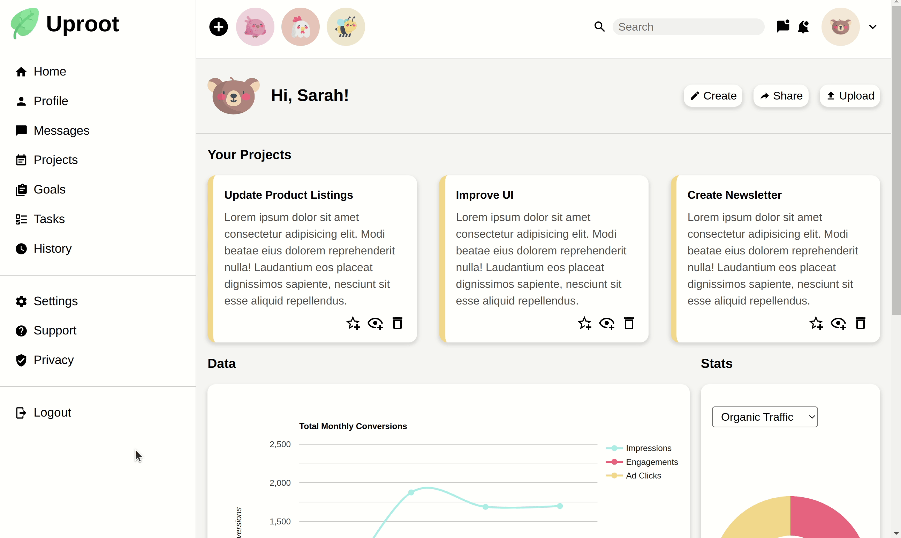

# Admin Dashboard

## Project Summary

This project exercise, created by The Odin Project, is a full dashboard design
intended to demonstrate the use of CSS Grid and its capabilities. Inspired by
current dashboard templates, this project represents a creative approach to
achieving responsive layouts from both a design and functional perspective.

## In Action

### Features Overview

### Responsiveness

## Credits

The design of my admin dashboard is inspired by the following sources:

* [Design One](https://cdn.statically.io/gh/TheOdinProject/curriculum/main/html_css/grid-lessons/project-dashboard/dashboard-project.png) by [The Odin Project](https://www.theodinproject.com/)

* [Design Two](https://dribbble.com/shots/17473449-Analytics-Dashboard-UI-Concept/attachments/12608049?mode=media)
by [AR Shakir](https://dribbble.com/arshakir) on Dribbble

* [Design Three](https://dribbble.com/shots/16755561-Management-Dashboard) by
[AR Shakir](https://dribbble.com/arshakir) on Dribbble

* [Design Four](https://themes.getbootstrap.com/product/clever-admin-dashboard-template/)
by [Bootstrap](https://themes.getbootstrap.com/)

* [Design Five](https://dribbble.com/shots/4518513-Freebie-Dashboard-Design) by
[Subash Chandra](https://dribbble.com/subash_chandra) on Dribbble

Icons provided by the following sources:

* [Cute icons](https://www.flaticon.com/packs/nature-and-animals-3?word=animal) by [Freepik](https://www.flaticon.com/authors/freepik) on Flaticon

* [Designer icons](https://materialdesignicons.com/) by Material Design Icons

Line graph created by the following website:

* https://www.rapidtables.com/tools/line-graph.html